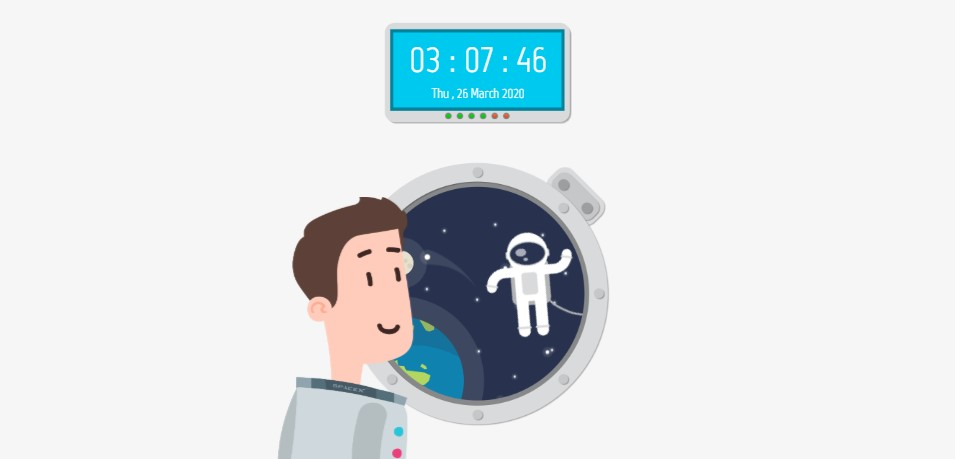
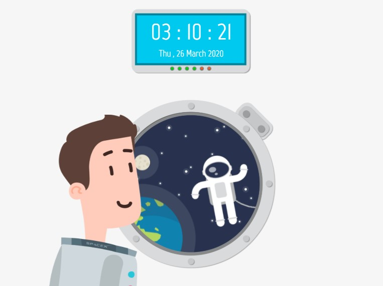
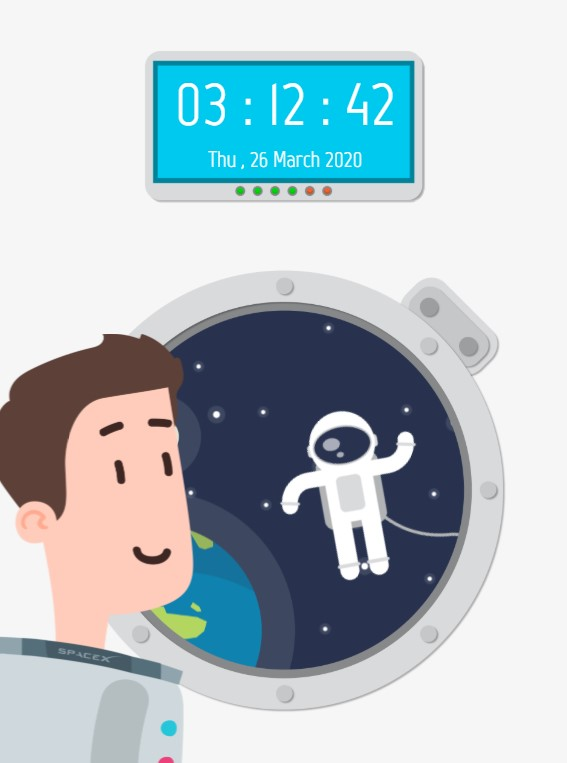
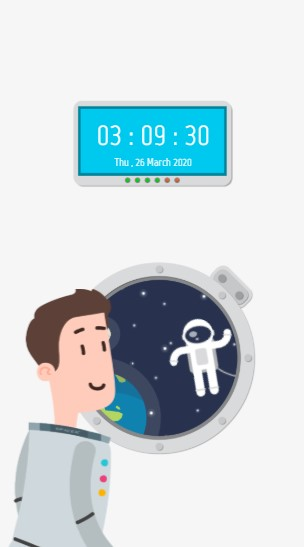
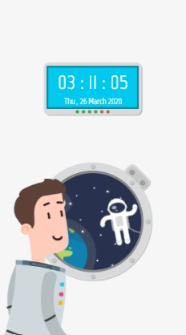

 <h1>Welkom op mijn website</h1>

  Hier vindt u een korte uitleg over de website dat ik heb gemaakt.
Elon Musk wilde van ons een geanimeerde klok waar de huidige aardse tijd op verschillende schermen te zien is. Via javascript heb ik de tijd maar ook de datum weten te coderen. Via TweenMax heb ik de animatie van mijn website op de website kunnen toepassen. Als je op de website bent, zie je bovenaan de klok die Elon Musk van ons wilden. Gelijk eronder zie je een raam met een uitzicht op de melkweg. 

Als animatie op de website zie je dat de sterren bewegen, de astronaut in de ruimte zweeft en de aarde om zijn eigen as heen draait. Als extra komt er om de 10 seconde een astronaut naar buiten kijken.

Tijdens het maken van de website heb ik de volgende afmetingen gebruikt in Chrome:

  Website 1280 x 620,

 
 

<h4>iPad liggend 1024 x 768,</h4>
 

iPad staand 768 x 1024,
 

Galaxy A70 414 x 736,
 

Apple 5/SE 320 x 568
 

<a href="https://elmas04.github.io/17105226-CMD-XT2-challenge2/">KLIK HIER OM NAAR CHALLENGE 2 TE GAAN</a>

